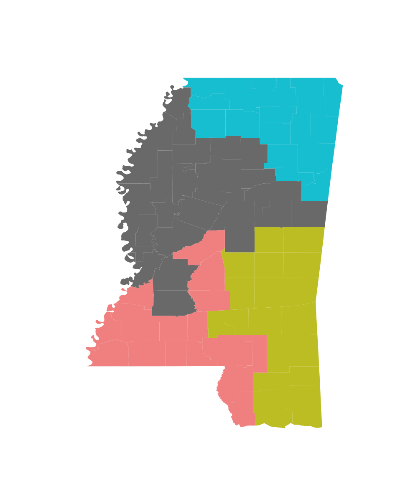

# Bounding the number and the diameter of compact Black-majority districts
This GitHub repository contains all the code, data, and results used in the paper "Bounding the number and the diameter of compact Black-majority districts," authored by Samuel Kroger, Hamidreza Validi, Illya V. Hicks, and Tyler Perini. 

This paper proposes mixed integer programming (MIP) formulations and techniques to explore the maximum number of Black-majority congressional districts for multiple states of the United States. Furthermore, we generalize the diameter-based compactness criterion of Garfinkel and Nemhauser (*Management Science*, 1970) and provide a framework for optimizers to capture compactness in constraints rather than the objective function. To alleviate the solving process, we propose fixing procedures and symmetry-breaking constraints. Our proposed MIP formulations provide (i) an upper bound on the number of Black-majority districts and (ii) lower bounds for the diameter of districts. We finally run a state-of-the-art districting package, GerryChain, to provide feasible bounds for the maximum number of Black-majority districts. This provides the best-known existing optimality gap that can be closed by both districters and optimizers in the future. 

# Recent News

Twenty-eight percent of the population in Alabama is Black.
Despite this the 2020 districting plan for Alabama included only one majority Black district out of it's seven districts.
In November of 2021 multiple parties sued arguing that the 2020 districting plan didn't adhere to the Voting Rights Act.
This case was assigned to a three judge district court in January 24, 2022.
The main argument that took course throughout the trial was whether or not the plaintiffs could produce a reasonable districting plan with two majority-minority districts.
Both the defense and plaintiff relied heavily on computational methods to generate and evaluate districting plans.
The courts ruled in favor of the plaintiff and found the 2020 districting plan unconstitutional as it violated the Voting Rights Act.
The case was than appealed to the Supreme Court.
On June 8th the supreme court in a 5-4 decision agreed the districting plan violated the Voting Rights Act and required the state of Alabama to form an additional majority Black district.

[The full brief of Allen V. Milligan](https://www.google.com/url?sa=t&rct=j&q=&esrc=s&source=web&cd=&ved=2ahUKEwi3-ubP7MD_AhV5AjQIHR_rDlwQFnoECB0QAQ&url=https%3A%2F%2Fwww.supremecourt.gov%2Fopinions%2F22pdf%2F21-1086_1co6.pdf&usg=AOvVaw2Ng7CmddUuLyeg__9GeXcB)

# US house of representatives political redistricting.
The constitution grants each state in the United States a certain number of seats in the house of representatives. The people occupying these seats play a crucial role in in making and passing federal laws. Every ten years each state in the United States is tasked with partitioning itself into congressional districts. The population of each congressional district then elects an individual to represent them in the house of representatives. 

This work is also particularly interested in section 2 of the voting rights act. Section 2 of the voting rights act defines majority-minority districts and gives criteria which if met requires a state to enact a plan that includes majority-minority districts.

The problem this code helps solve is how to partition a state fairly. We are not arguing that this is the best or only way to accomplish this; with this is mind there are a hand full of goals our maps try to accomplish:

1. Population distribution - In this work each districting plan generated is within 1% population deviation of any other district. 

2. Connectivity - We require that every feasible districting plan has every component form a connected graph

3. Compactness - We try to form districts as compact as possible. In this work we enforce compactness by forcing each district in a districting plan to have some maximum diameter. 

4. Minority districts - We attempt to find out how many minority districts can be formed in each state which fit the quantifiable portions of the Gingles Prongs from section 2 of the voting rights act.

# Maps we generated
Here is a districting plan of MS on the county level we genearte with one minority district (in gray).



# How to run the code yourself

All of the code works off running comp_experiment.py and can be excuted with the following line:
```
C:\src\comp_expermient.py
```
At the bottom of comp_experiment.py you will find all the run options.
Simply uncomment a line in comp_experiment.py to generate the corresponding table.
